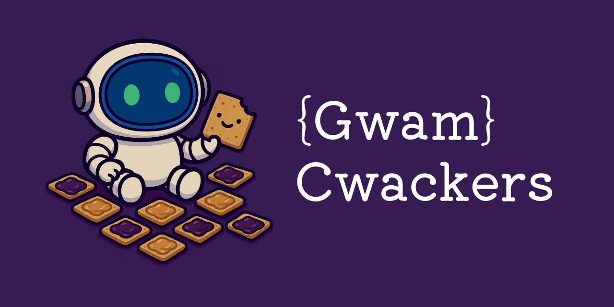
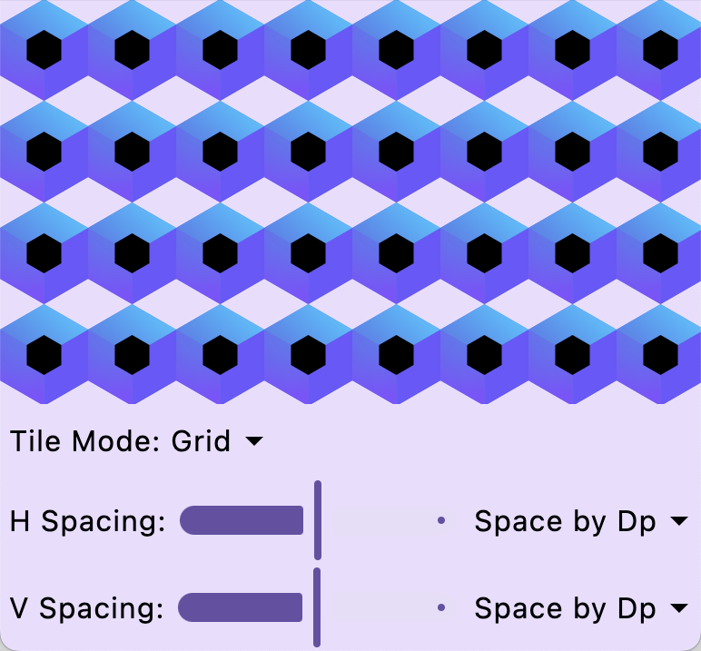
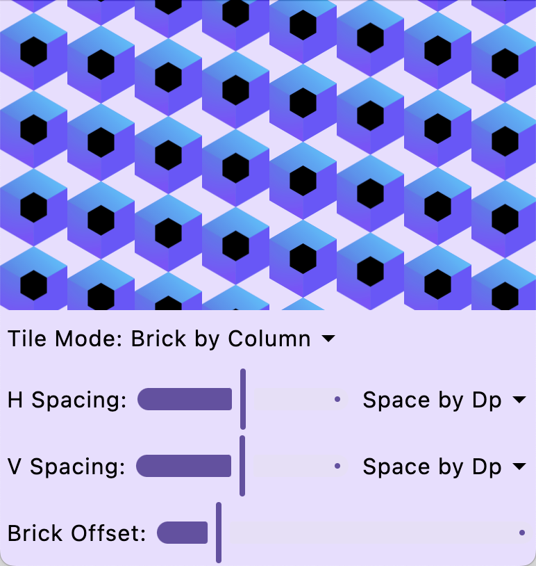
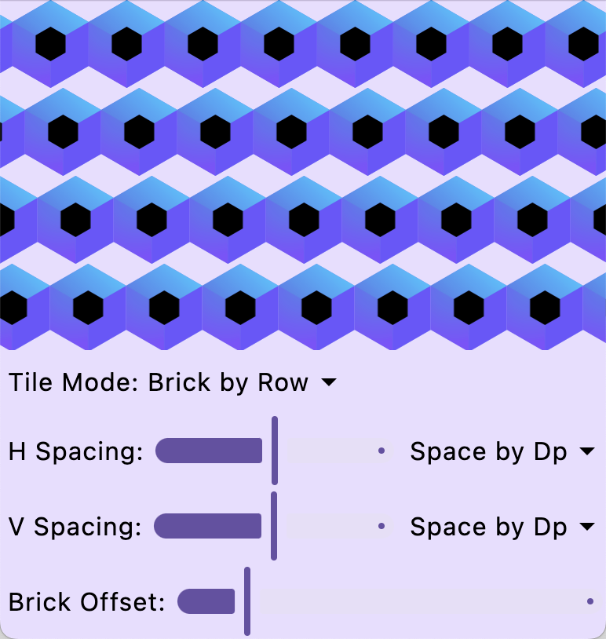
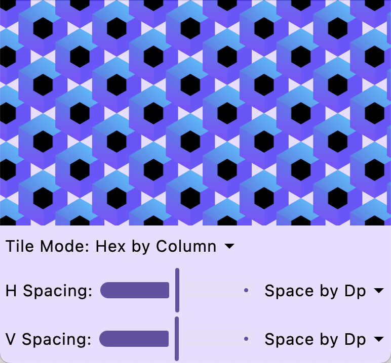
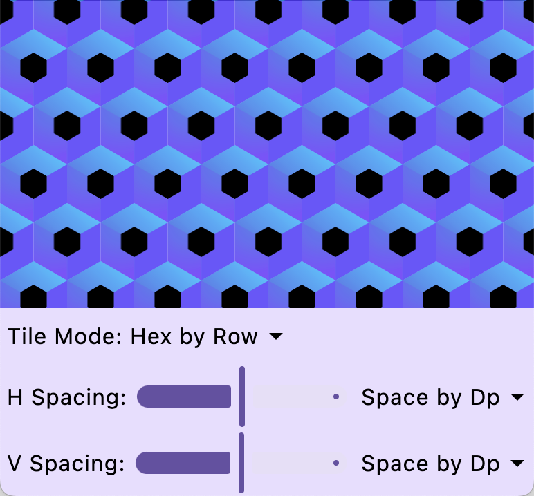

# Cwackers

_Advanced Image Tiling for Compose Multiplatform_

Cwackers is a Kotlin Multiplatform library that brings advanced image tiling support to Jetpack Compose.
It implements the same 5 tiling modes found in Adobe Illustrator and other design programs, making it simple to go from design to implementation without hacks like adding artificial whitespace or clever cropping.

## Why Cwackers?

Out of the box, Compose only supports simple grid tiling using an ImageShader. With Cwackers, you get full parity with Illustrator’s tiling system, meaning you can replicate your design mockups directly in code - no extra image editing required.
This means all tiling modes (grid, brick by column, brick by row, hex by column, and hex by row) are available. All options for each mode, including spacing, tile alpha, and offsets are also available.

# Grid


# Brick by Column


# Brick by Row


# Hex by Column


# Hex by Row


## Getting Started

To integrate Cwackers into your Compose Multiplatform project, follow these steps:

1.  **Add the dependency:**

    ```kotlin
    // In your module's build.gradle.kts
    iosMain {
      implementation("com.infiniteretry.cwackers:cwackers:1.0.0")
    }
    ```

2.  **Use the simple modifier**

    ```kotlin
    @Composable
    fun MyScreen() {
      Box(
        modifier = Modifier
          .fillMaxSize()
          .tiledBackground(
            painter = painterResource(R.drawable.my_cool_tile), // Replace with Res.drawable.my_cool_tile for CMP
            tileMode = TileMode.HexByRow(), // Lots of customizability here
          ),
      )
    }
    ```

## License

```
Copyright 2025 Infinite Retry Labs

Licensed under the Apache License, Version 2.0 (the "License");
you may not use this file except in compliance with the License.
You may obtain a copy of the License at

    http://www.apache.org/licenses/LICENSE-2.0

Unless required by applicable law or agreed to in writing, software
distributed under the License is distributed on an "AS IS" BASIS,
WITHOUT WARRANTIES OR CONDITIONS OF ANY KIND, either express or implied.
See the License for the specific language governing permissions and
limitations under the License.
```